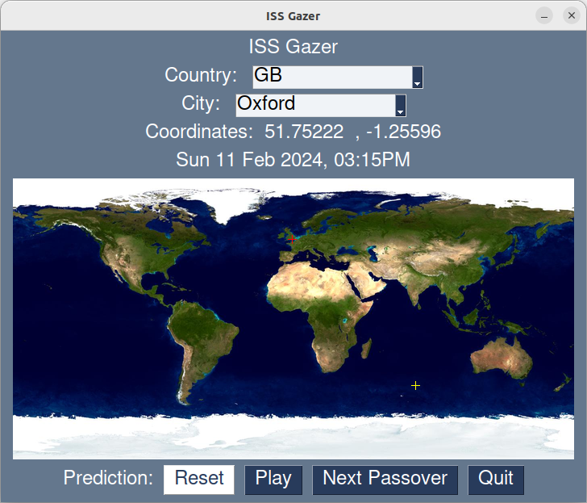

# ISS gazer

## Purpose

Tool to predict next times when the ISS is flying over your home. Tells you how well it is visible.

Visualizes predicted ISS trajectory on world map. User interaction to predict position for selected location.

## How it works

Latest ISS trajectory data needs to be fetched from [ARISS](https://live.ariss.org/iss.txt).

User chooses country and city to specify coordinates (latitude/longitude) of observer.

Predicts orbit of ISS and next passover timings.

## Software dependencies

- [Wrapper for orbit predictor](https://github.com/satellogic/orbit-predictor). Included as git submodule.
- PySimpleGUI for user interaction visualisation.
- [SGP4](https://github.com/brandon-rhodes/python-sgp4) for orbit prediction.
- [Python Image Library](https://python-pillow.org/) for showing the world map.

These modules can be installed with pip, using the `requirements.txt` file. See below

## Install and run
It's recommended to use virtual environments to avoid a headache with Python module conflicts. Enter `python3 -m venv .` into the command line. If this does not work, you might need to install venv.
Start it using `source ./bin/activate`

Install modules:
`pip install -r requirements.txt `

Run the code:
`cd ISSgazer`
`python main.py`

Note that for high prediction accuracy it is a good idea to get the latest ISS trajectory data from [ARISS](https://live.ariss.org/iss.txt). Copy the coordinates into the `iss.tle` file in the data directory.

## Future work
- More user friendly selection of observer location.
- Load latest ISS coordinates automatically.
- Show local timezones of selected observation location instead of UTC.
- Filter predictions by closest distance.
- Filter predictions by time delta to sunrise or sunset.
- Weather forecast for next passes.

